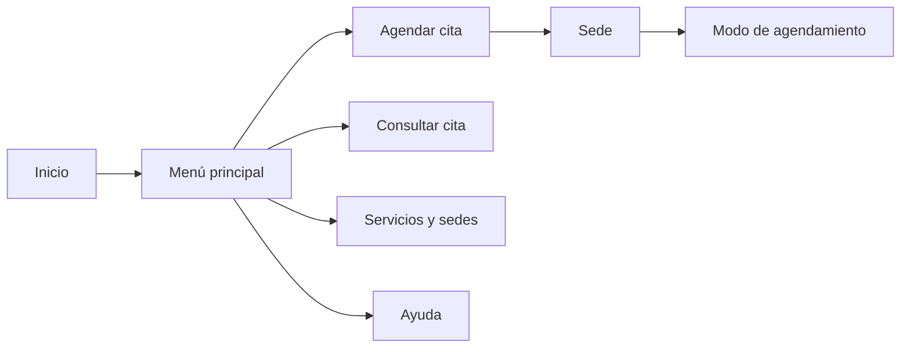
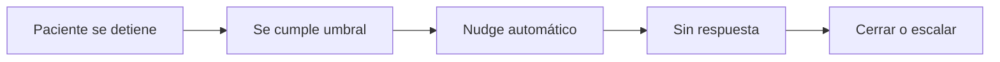

# Manual WhatsApp CIVE

Guion didáctico para presentar y compartir el estado actual del bot de WhatsApp de CIVE.

Uso recomendado:
- base para Figma Slides
- base para Google Slides
- documento de alineación con Marketing y Contact Center

Dirección visual sugerida:
- fondo claro
- acentos verde WhatsApp + azul clínico
- bloques cortos
- iconografía simple
- evitar párrafos largos

## Slide 1. Portada

**Título**
`Manual Operativo del Bot de WhatsApp`

**Subtítulo**
`CIVE | Flujo, abandono y recordatorios automáticos`

**Visual**
- fondo limpio
- ojo o ícono de WhatsApp en grande
- etiqueta pequeña: `Versión productiva actual`

## Slide 2. Objetivo

**Título**
`¿Qué resuelve el bot?`

**Bullets**
- Agendar citas de forma guiada
- Responder información frecuente
- Orientar por síntomas
- Detectar abandono del flujo
- Enviar recordatorios automáticos

**Mensaje clave**
`El bot reduce fricción operativa, pero no reemplaza los casos que requieren intervención humana.`

## Slide 3. Menú principal

**Título**
`Menú principal actual`

**Bullets**
- 📅 Agendar cita
- 📄 Consultar cita
- 📍 Servicios y sedes
- 🎁 Promociones
- 🆘 Ayuda

**Visual**
- mockup de lista o botones

## Slide 4. Vista general del flujo

**Título**
`Flujo principal`

**Bullets**
- Entrada al bot
- Selección de opción
- Captura de datos básicos
- Resolución de agenda o información
- Confirmación o derivación humana

**Diagrama sugerido**

## Slide 5. Modos de agendamiento

**Título**
`Formas de agendar`

**Bullets**
- Por especialidad
- Por doctor
- Por fecha
- Describir síntomas

**Mensaje clave**
`El flujo no obliga a un único camino. Se adapta a cómo piensa el paciente.`

## Slide 6. Agendamiento por especialidad

**Título**
`Ruta por especialidad`

**Bullets**
- Sede
- Especialidad
- Médico disponible
- Fecha
- Horario
- Confirmación

**Nota**
`Las especialidades visibles están curadas para paciente y mapeadas internamente a la lógica clínica real.`

## Slide 7. Agendamiento por doctor

**Título**
`Ruta por doctor`

**Bullets**
- Búsqueda por nombre
- Selección del médico
- Sede del doctor
- Fecha
- Horario
- Confirmación

**Mensaje clave**
`La búsqueda tolera mejor nombres largos y variaciones de escritura.`

## Slide 8. Agendamiento por fecha

**Título**
`Ruta por fecha`

**Bullets**
- Sede
- Fecha disponible
- Médicos disponibles
- Horario en tiempo real
- Confirmación

**Mensaje clave**
`La fecha y el médico se navegan con disponibilidad local; el horario final se consulta en vivo.`

## Slide 9. Orientación por síntomas

**Título**
`Ruta por síntomas`

**Bullets**
- El paciente describe su caso
- El bot sugiere especialidad
- Si detecta urgencia, deriva
- Si no, continúa a agenda

**Mensaje clave**
`No sustituye criterio médico. Orienta la entrada del paciente al flujo correcto.`

## Slide 10. Servicios y sedes

**Título**
`Información directa`

**Bullets**
- Dirección de Villa Club
- Dirección de Ceibos
- Horarios de atención
- Especialidades
- Precios con apoyo humano

**Nota**
`La información básica ya no depende de fallback genérico o de respuestas vacías.`

## Slide 11. Navegación del usuario

**Título**
`Cómo se mueve el paciente`

**Bullets**
- `ATRÁS` para volver
- `MENU` para salir
- botones y listas donde aplica
- continuidad del estado actual

**Mensaje clave**
`El flujo evita callejones sin salida.`

## Slide 12. Qué pasa si el paciente deja de responder

**Título**
`Abandono del flujo`

**Bullets**
- El bot monitorea estados críticos
- Si detecta inactividad, espera el umbral
- Envía un nudge automático
- Luego cierra o escala según criticidad

**Visual sugerido**

## Slide 13. ¿Qué es un nudge?

**Título**
`Nudge`

**Definición corta**
`Es un mensaje breve de reactivación, enviado después de un periodo de inactividad para confirmar si el paciente aún desea continuar.`

**Ejemplo**
`😔 Parece que se interrumpió tu proceso. Si aún deseas continuar con tu cita, responde este mensaje y con gusto te ayudo.`

## Slide 14. Lógica de abandono actual

**Título**
`Regla actual`

**Bloque 1**
`Baja intención`
- consentimiento
- cédula
- correo
- origen
- sede
- modo
- especialidad temprana

**Bloque 2**
`Alta intención`
- médico
- fecha
- horario
- confirmación
- gestión de cita vigente

**Cierre**
`Baja intención: nudge + cierre`
`Alta intención: nudge + posible humano`

## Slide 15. Casos que sí pasan a humano

**Título**
`Cuándo interviene un agente`

**Bullets**
- El paciente pide ayuda
- Hay cita vigente con gestión
- El caso quedó en etapa avanzada
- Un recordatorio dispara solicitud de agente

## Slide 16. Recordatorios automáticos

**Título**
`Recordatorios por WhatsApp`

**Bullets**
- Plantilla oficial aprobada
- Ventanas de 24h y 2h
- Hora local de Guayaquil
- Respuesta: confirmar o comunicarse con un agente

**Mensaje clave**
`El recordatorio no depende de tener conversación abierta si existe plantilla aprobada.`

## Slide 17. Fuente de datos de recordatorios

**Título**
`De dónde salen los recordatorios`

**Bullets**
- Fuente base: `procedimiento_proyectado`
- Clasificación:
  - `SERVICIOS OFTALMOLOGICOS GENERALES`
  - `IMAGENES`
- Destino:
  - historial de conversación WhatsApp
  - o celular clínico normalizado

## Slide 18. Recordatorios de servicios

**Título**
`Servicios oftalmológicos generales`

**Bullets**
- Un recordatorio por evento
- Se conserva doctor, sede y hora real
- Permite confirmar o pedir agente

## Slide 19. Recordatorios de imágenes

**Título**
`Imágenes: consolidación inteligente`

**Bullets**
- Si un paciente tiene varios exámenes el mismo día
- no recibe varios recordatorios
- se consolida en un solo mensaje
- se usa la primera hora del bloque

**Ejemplo**
- 09:10 OCT
- 09:15 Topografía
- 09:20 Microscopia

**Resultado**
`1 solo recordatorio`

## Slide 20. Qué evita saturación

**Título**
`Controles para no saturar`

**Bullets**
- No duplicar el mismo evento
- Máximo por paciente por día
- Bloqueo por outbound reciente
- Configuración dinámica desde settings

## Slide 21. Configuración dinámica

**Título**
`Qué puede ajustar el equipo`

**Bullets**
- encender o apagar recordatorios
- templates
- ventanas
- timezone
- máximo diario
- keywords de clasificación
- rol para agente

**Ruta**
`/v2/settings?section=whatsapp`

## Slide 22. Qué no depende del usuario final

**Título**
`Dependencias operativas`

**Bullets**
- plantilla aprobada en Meta
- scheduler activo
- settings guardados
- fuente de agenda consistente
- datos del paciente normalizados

## Slide 23. Checklist de activación

**Título**
`Checklist operativo`

**Bullets**
- plantilla oficial validada
- settings configurados
- dry-run probado
- prueba a número controlado
- scheduler verificado
- monitoreo post-activación

## Slide 24. Cierre

**Título**
`Estado actual`

**Bullets**
- Bot productivo
- Flujo estabilizado
- Abandono monitoreado
- Recordatorios listos
- Operación más controlada

**Cierre corto**
`El sistema ya no solo conversa: también monitorea, recuerda y ordena mejor la atención.`

## Notas visuales globales

- Mantener 1 idea principal por slide
- No más de 4 a 5 bullets por slide
- Usar títulos cortos
- Combinar texto con mockups, checklist o diagramas
- Slides 4, 12, 16 y 19 deben llevar visual

## Notas para el presentador

- Evitar explicar el sistema como “IA que hace todo”
- Enfatizar:
  - reducción de fricción
  - control de abandono
  - recordatorios útiles
  - intervención humana donde sí agrega valor
- Para Marketing:
  - resaltar conversión y experiencia
- Para Contact Center:
  - resaltar continuidad operativa y reducción de ruido
